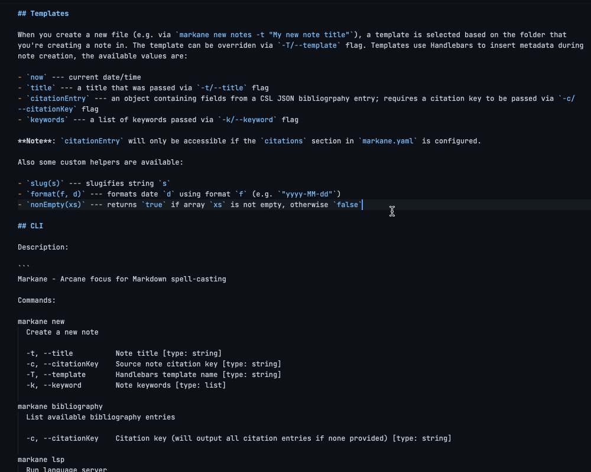
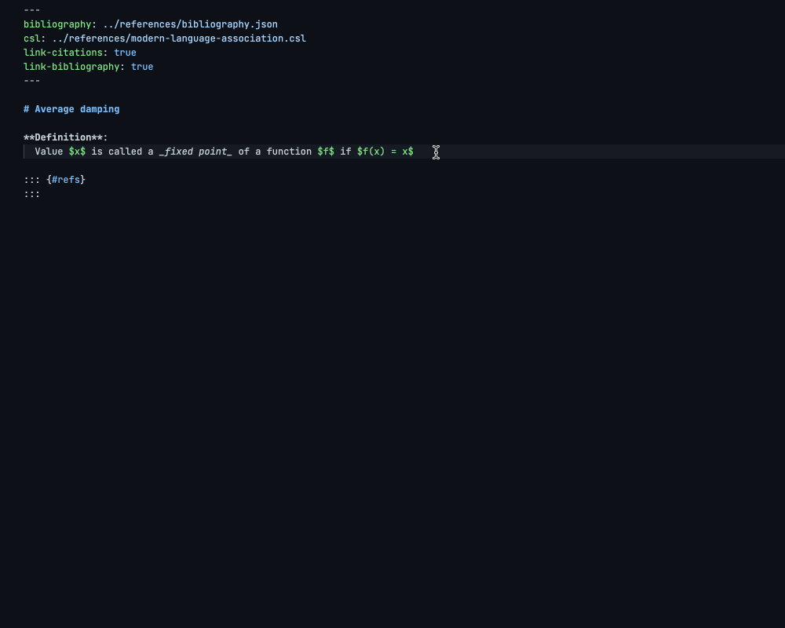
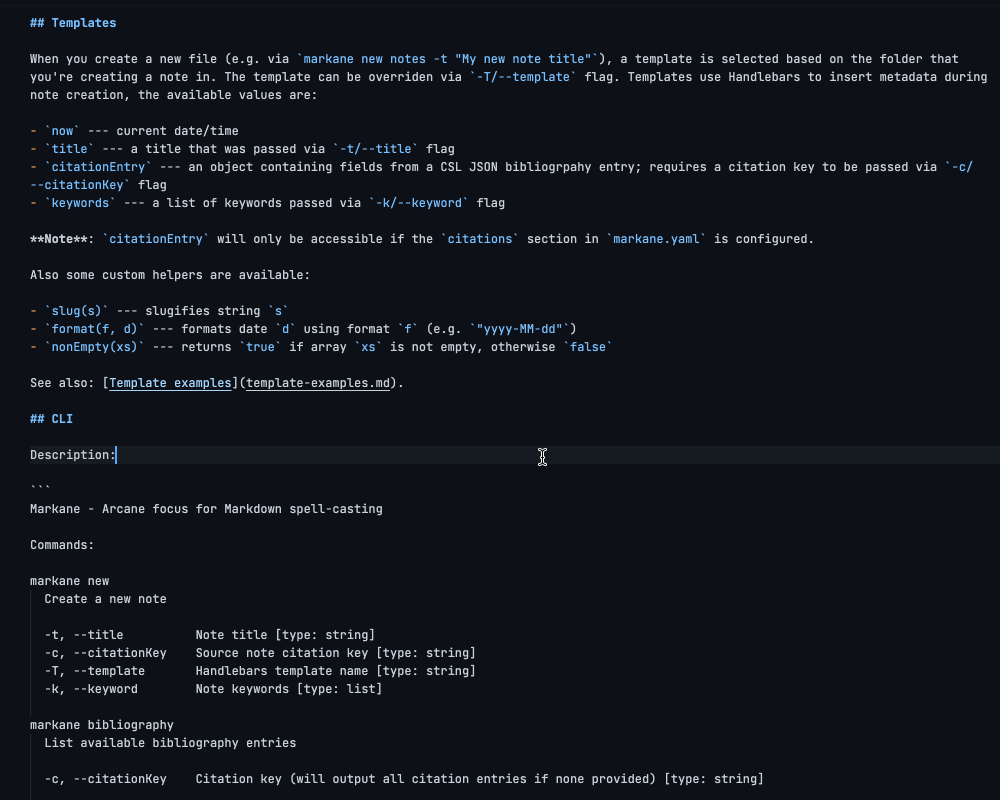
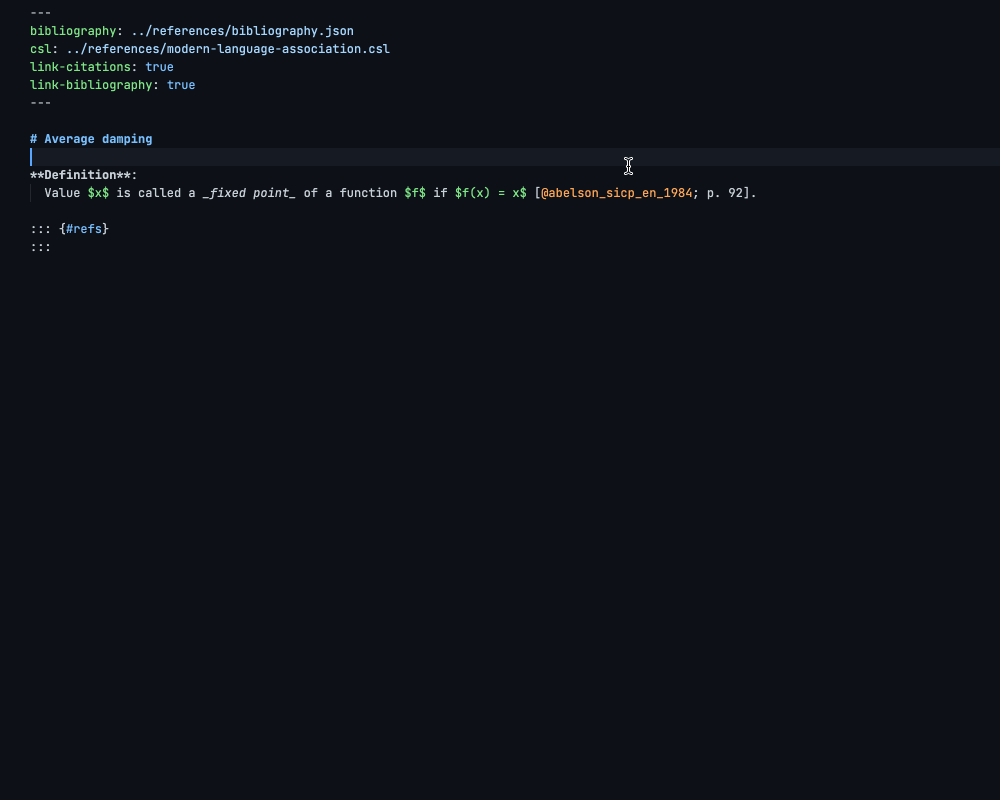
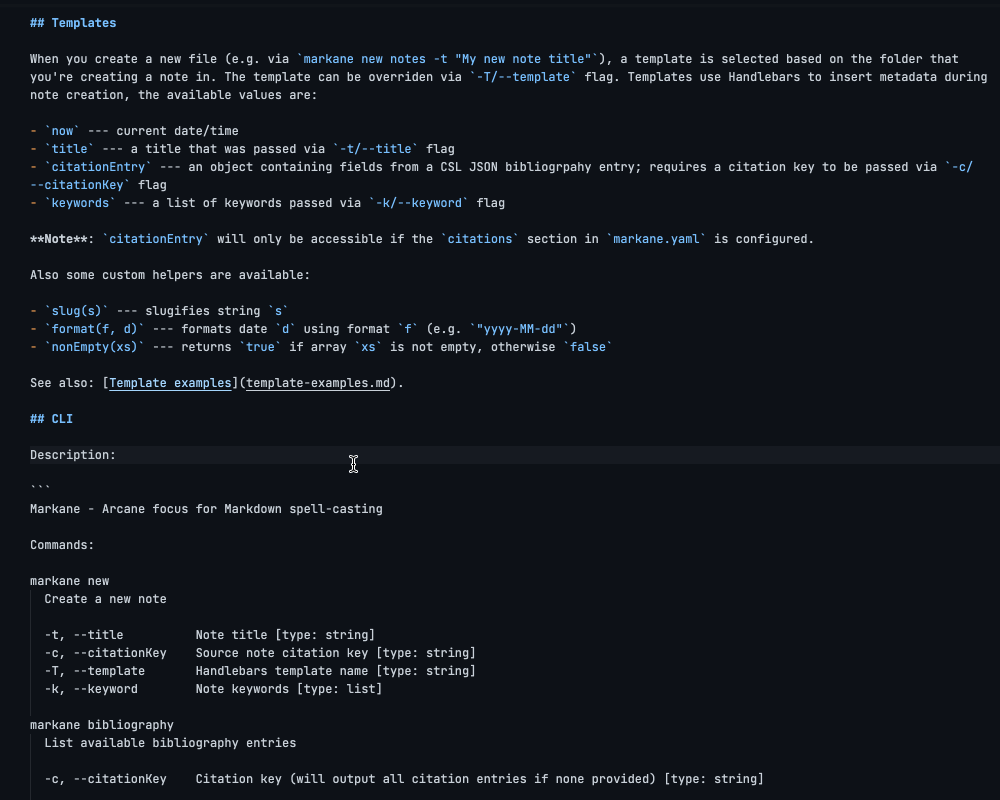
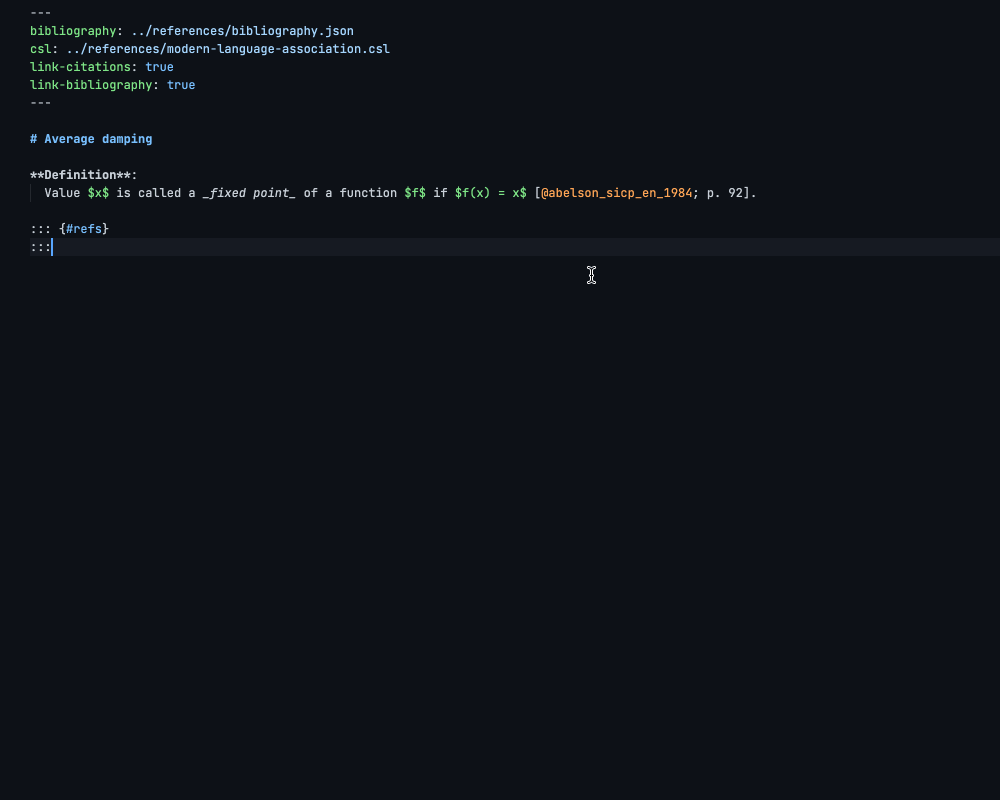
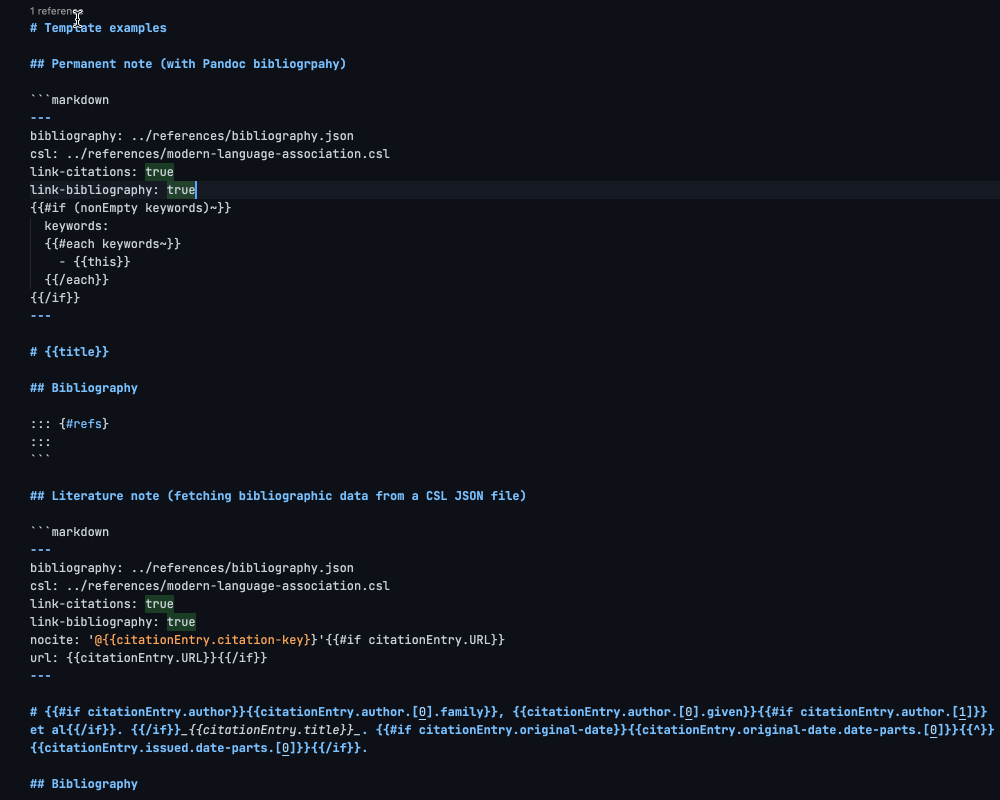
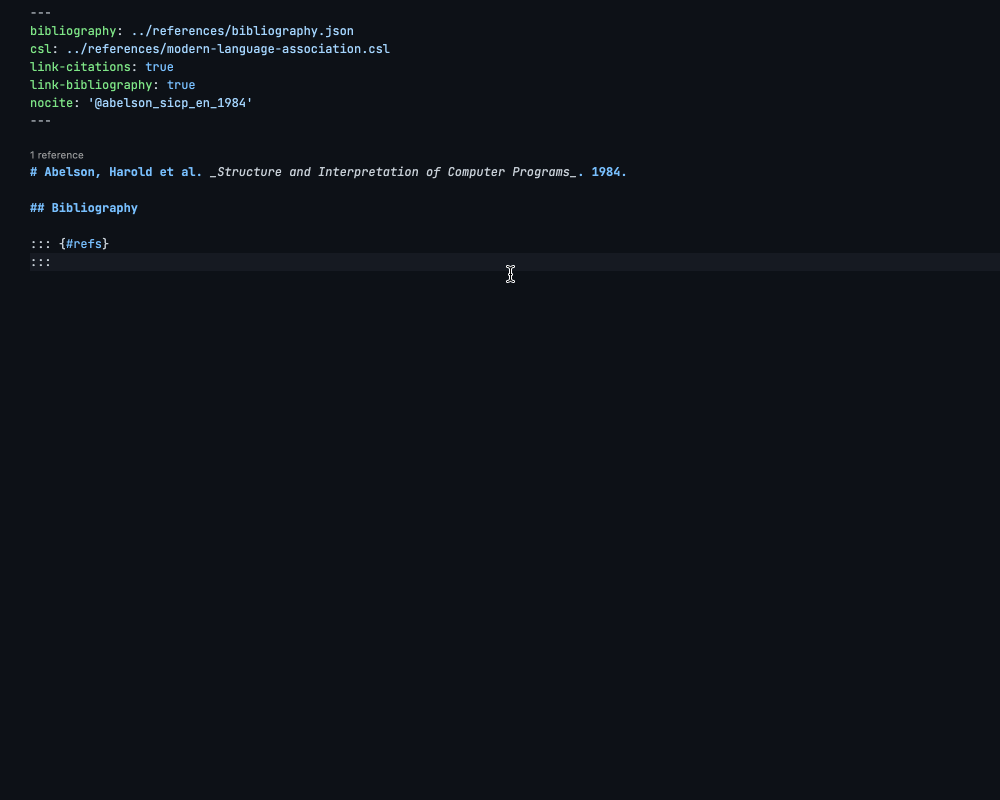
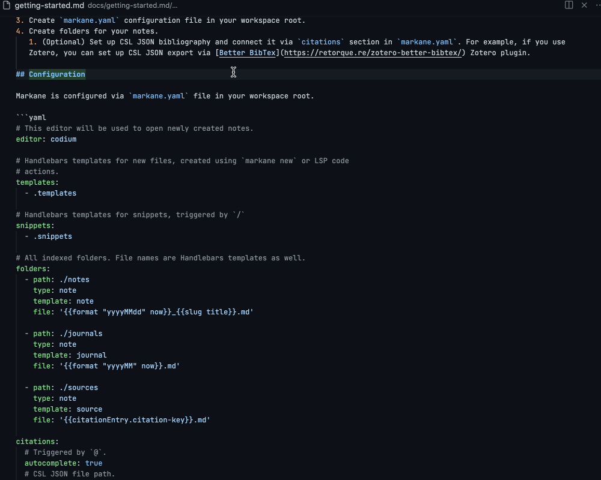
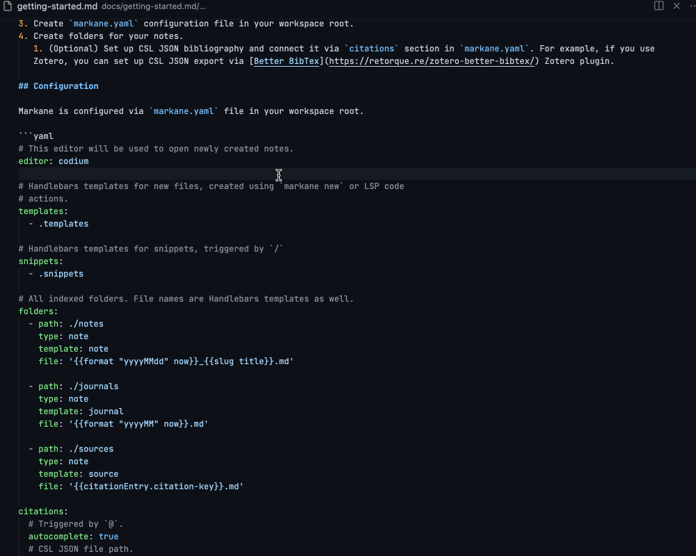

# Markane

_Arcane focus for Markdown spell-casting_

## Description

Markane is a command-line tool for taking Markdown notes and navigating between them. The preferred Markdown dialect is Pandoc Markdown, although you can use it with CommonMark if you don't use some Pandoc-related features. Markane features include:

- Creating notes from Handlebars templates
- Preview on hover (links, images, citations)
- Auto-completion (links, citations, snippets)
- Go-to-definition (links, citations)
- Backlinks (links, citations)
- Symbols (workspace-level, document-level)

## Documentation

- [Getting started](docs/getting-started.md)
- [Editor integration](docs/editor-integration.md)
- [Template examples](docs/template-examples.md)

## Features

### Auto-completion

Links

Citations

### Preview on hover

Links

Citations

### Go to definition

Links

Citations

### Backlinks

Links

Citations

### Symbols

Workspace

Document

## Similar projects

- mickael-menu's [zk](https://github.com/mickael-menu/zk) — a similar tool with more focus on a powerful command-line interface and less focus on editor integration; supports `[[wiki-links]]` and has the ability to query notes from CLI.
